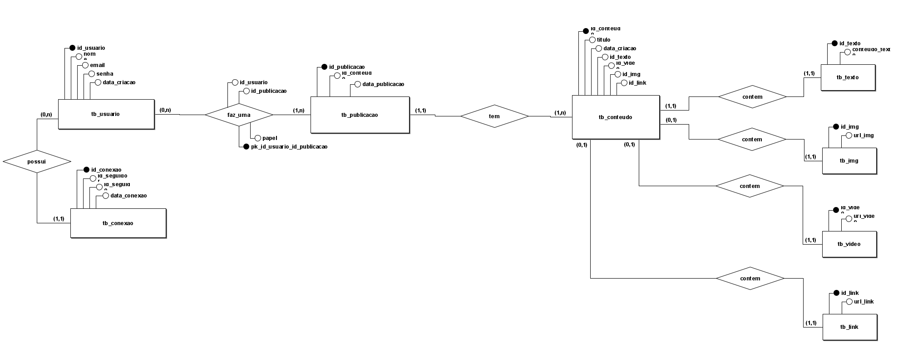

# Documentação do Banco de Dados da Rede Social

# Descrição do Minimundo

João percebeu que as redes sociais atuais não atendem mais às suas necessidades e de seus amigos. Elas se tornaram complicadas, impessoais e limitadas para aqueles que desejam criar um ambiente mais próximo e interativo. Decidido a mudar essa realidade, João idealizou a criação de uma nova rede social, pensada para facilitar conexões verdadeiras e interação significativa entre os usuários. Nesta plataforma, os usuários poderão seguir pessoas para acompanhar conteúdos de seu interesse. Além disso, poderão publicar conteúdos permitindo que indivíduos com interesses em comum compartilhem ideias e experiências em um espaço dedicado. O sistema foi concebido para registrar todas as interações entre os usuários. A proposta é oferecer um ambiente onde cada usuário tenha controle sobre suas interações, além de uma interface intuitiva que permita o gerenciamento fácil de informações pessoais e conteúdos compartilhados. Essa nova rede social busca fortalecer os laços comunitários, proporcionando uma experiência personalizada e acessível que reflete os valores de proximidade e autenticidade que João e seus amigos desejam. Com um design focado em interação e organização, o sistema será um espaço digital que prioriza o relacionamento humano.

## Requisitos funcionais

**RF1. Gerenciamento de Usuários:**

- **Cadastro de usuários:** Permitir a criação de novos usuários com informações como nome, email e senha.
- **Atualização de informações de usuários:** Permitir que os usuários modifiquem suas informações cadastrais, como nome e senha.
- **Exclusão de usuários:** Permitir a exclusão de usuários da rede social.
- **Busca de usuários:** Permitir a busca de usuários por diferentes critérios (nome, email, etc.).

**RF2. Gerenciamento de Conexões:**

- **Criar conexões:** Permitir que usuários se conectem entre si (seguir/ser seguido).
- **Remover conexões:** Permitir que usuários removam conexões existentes.
- **Listar conexões:** Permitir que usuários visualizem suas conexões (quem seguem e quem os segue).

**RF3. Gerenciamento de Conteúdo:**

- **Criar conteúdo:** Permitir que usuários criem conteúdos com títulos e textos.
- **Atualizar conteúdo:** Permitir que usuários modifiquem o conteúdo que criaram.
- **Excluir conteúdo:** Permitir que usuários excluam o conteúdo que criaram. **Buscar conteúdo:** Permitir a busca de conteúdo por diferentes critérios (título, autor, etc.).

**RF4. Gerenciamento de Publicações:**

- **Criar publicações:** Permitir que usuários publiquem conteúdo.
- **Associar autores a publicações:** Registrar os autores de cada publicação, com diferentes papéis (autor principal, coautor, revisor, etc.).
- **Atualizar informações de publicações:** Permitir a atualização de informações sobre as publicações, como a lista de coautores.
- **Excluir publicações:** Permitir que usuários excluam publicações.
- **Buscar publicações:** Permitir a busca de publicações por diferentes critérios (data, autor, conteúdo, etc.).

**RF5. Funcionalidades Adicionais:**

- **Gerenciamento de coautoria:** Permitir que múltiplos usuários colaborem na criação de publicações, definindo seus papéis e responsabilidades.
- **Estatísticas de conteúdo:** Gerar estatísticas sobre o conteúdo, como o número de publicações por conteúdo.
- **Análise de conexões:** Analisar as conexões entre usuários, identificando padrões e relações.

## Delimitação do minimundo para o banco de dados

### 1. Tabela: `tb_usuario`

**Descrição:** Armazena informações dos usuários registrados na plataforma.

- **id_usuario** (SERIAL): Identificador único do usuário.
- **nome** (VARCHAR(100)): Nome do usuário. _Obrigatório._
- **email** (VARCHAR(150)): Email do usuário. _Obrigatório._
- **senha** (TEXT): Senha criptografada do usuário. _Obrigatório._
- **data_criacao** (TIMESTAMP): Data de criação do registro. _Padrão: CURRENT_TIMESTAMP._

### 2. Tabela: `tb_conexao`

**Descrição:** Representa conexões entre usuários (seguidores e seguidos).

- **id_conexao** (SERIAL): Identificador único da conexão.
- **id_seguidor** (INT): Identificador do usuário que segue. _Obrigatório._
- **id_seguido** (INT): Identificador do usuário seguido. _Obrigatório._
- **data_conexao** (TIMESTAMP): Data de criação da conexão. _Padrão: CURRENT_TIMESTAMP._

### 3. Tabela: `tb_publicacao`

**Descrição:** Armazena informações básicas sobre publicações realizadas pelos usuários.

- **id_publicacao** (SERIAL): Identificador único da publicação.
- **id_conteudo** (INT): Identificador do conteúdo relacionado. _Obrigatório._
- **data_publicacao** (TIMESTAMP): Data de publicação. _Padrão: CURRENT_TIMESTAMP._

### 4. Tabela: `tb_conteudo`

**Descrição:** Armazena diferentes tipos de conteúdo (texto, imagem, vídeo, link).

- **id_conteudo** (SERIAL): Identificador único do conteúdo.
- **titulo** (VARCHAR(50)): Título do conteúdo.
- **data_criacao** (TIMESTAMP): Data de criação do conteúdo. _Padrão: CURRENT_TIMESTAMP._
- **id_texto** (INT): Identificador do conteúdo de texto.
- **id_img** (INT): Identificador do conteúdo de imagem.
- **id_video** (INT): Identificador do conteúdo de vídeo.
- **id_link** (INT): Identificador do conteúdo de link.

### 5. Tabela: `tb_texto`

**Descrição:** Armazena conteúdos em formato de texto.

- **id_texto** (SERIAL): Identificador único do texto.
- **conteudo_texto** (TEXT): Texto do conteúdo. _Obrigatório._

### 6. Tabela: `tb_img`

**Descrição:** Armazena informações de imagens.

- **id_img** (SERIAL): Identificador único da imagem.
- **url_img** (TEXT): URL da imagem. _Obrigatório._

### 7. Tabela: `tb_video`

**Descrição:** Armazena informações de vídeos.

- **id_video** (SERIAL): Identificador único do vídeo.
- **url_video** (TEXT): URL do vídeo. _Obrigatório._

### 8. Tabela: `tb_link`

**Descrição:** Armazena informações de links externos.

- **id_link** (SERIAL): Identificador único do link.
- **url_link** (TEXT): URL do link. _Obrigatório._

# Criar Tabelas e constraints

[Query das tabelas](DDL/criar_tabelas.sql)
[Query das constraints](DDL/constraints.sql)

# Popular tabelas

#### Os inserts para popular as tabelas foram feitos a partir de csv. Você pode utilizar o script em python para popular ou importar os csv de forma manual no DBeaver ou Pgadmin. Os Csv estão no diretorio `csv`

# RELACIONAMENTOS ENTRE TABELAS:

1.  **`tb_publicacao (1,1) → tb_conteudo (1,n)`**

- Uma publicação (`tb_publicacao`) está relacionada a **exatamente um** conteúdo (`tb_conteudo`) (**1,1**).

- Um conteúdo (`tb_conteudo`) pode estar relacionado a **uma ou mais** publicações (`tb_publicacao`) (**1,n**).

2.  **`tb_publicacao (1,n) → tb_usuario (0,n)`**

- Uma publicação (`tb_publicacao`) pode ter **um ou mais** autores (`tb_usuario`) (**1,n**).

- Um usuário (`tb_usuario`) pode ser autor de **zero ou mais** publicações (`tb_publicacao`) (**0,n**).

3.  **`tb_conexao(1,1) → tb_usuario (0,n)`**

- Um usuário (`tb_usuario`) pode estar associado a **zero ou mais** conexões (`tb_conexao`) (**0,n**).

- Cada conexão (`tb_conexao`) está associada a **exatamente um** usuário (`tb_usuario`) (**1,1**).

4.  **`tb_conteudo (1,1) → tb_texto (1,1)`**

- Um conteúdo (`tb_conteudo`) possui **exatamente um** texto associado (`tb_texto`) (**1,1**).

- Um texto (`tb_texto`) está associado a **exatamente um** conteúdo (`tb_conteudo`) (**1,1**).

5.  **`tb_conteudo (0,1) → tb_img (1,1)`**

- Um conteúdo (`tb_conteudo`) pode ter **no máximo uma** imagem associada (`tb_img`) (**0,1**).

- Uma imagem (`tb_img`) está associada a **no máximo um** conteúdo (`tb_conteudo`) (**1,1**).

6.  **`tb_conteudo (0,1) → tb_video (1,1)`**

- Um conteúdo (`tb_conteudo`) pode ter **no máximo um** vídeo associado (`tb_video`) (**0,1**).

- Um vídeo (`tb_video`) está associado a **no máximo um** conteúdo (`tb_conteudo`) (**1,1**).

7.  **`tb_conteudo (0,1) → tb_link (1,1)`**

- Um conteúdo (`tb_conteudo`) pode ter **no máximo um** link associado (`tb_link`) (**0,1**).

- Um link (`tb_link`) está associado a **no máximo um** conteúdo (`tb_conteudo`) (**1,1**).

# Modelo Conceitual:



# Modelo Lógico:


# PERGUNTAS ANALITICAS, RELATORIOS E DASHBOARD, MVIEWS, VIEWS E PROCEDURES

## As queries podem ser melhor vizualizadas [AQUI](DDL/queries_perguntas_analiticas.sql)

Estas são as 10 perguntas analíticas que podem ser usadas para compor dashboards ou relatórios periódicos para o banco de dados de uma rede social:  
Essas perguntas são úteis para extrair insights sobre o comportamento dos usuários, o desempenho da plataforma e as tendências na criação e consumo de conteúdo, possibilitando a tomada de decisões estratégicas.

# Este tópico cumpre os seguintes pré requisitos:

- **Quadro 5 - Domínio de BI**
  - P1. Perguntas analíticas
  - p2. Relatórios e dashboards
- **Quadro 3 - Domínio da aplicação**
  - P2. Sub-rotinas de suporte
  - 2 Mviews, 2 procedures

### 1. Crescimento de Usuários

- **Pergunta:** Quantos novos usuários se registraram a cada mês no último ano?
- **Objetivo:** Acompanhar o crescimento da base de usuários.

```sql
CREATE MATERIALIZED VIEW mv_crescimento_usuarios AS
SELECT
    DATE_TRUNC('month', data_criacao) AS mes,
    COUNT(id_usuario) AS novos_usuarios
FROM
    tb_usuario
GROUP BY
    DATE_TRUNC('month', data_criacao)
ORDER BY
    mes;
```

---

### 2. Tipo de Conteúdo Mais Utilizado

- **Pergunta:** Qual é a proporção de publicações que utilizam textos, imagens, vídeos ou links nos últimos 6 meses?
- **Objetivo:** Compreender as preferências dos usuários em relação ao tipo de conteúdo.

```sql
CREATE MATERIALIZED VIEW mv_tipo_conteudo AS
SELECT
    COUNT(CASE WHEN c.id_texto IS NOT NULL THEN 1 END) AS total_textos,
    COUNT(CASE WHEN c.id_img IS NOT NULL THEN 1 END) AS total_imagens,
    COUNT(CASE WHEN c.id_video IS NOT NULL THEN 1 END) AS total_videos,
    COUNT(CASE WHEN c.id_link IS NOT NULL THEN 1 END) AS total_links
FROM
    tb_conteudo c
JOIN
    tb_publicacao p ON c.id_conteudo = p.id_conteudo
WHERE
    p.data_publicacao >= now() - interval '6 months';
```

---

### 3. Conexões Estabelecidas

- **Pergunta:** Qual é o número total de conexões criadas por mês no último ano?
- **Objetivo:** Monitorar o engajamento entre os usuários.

```sql
CREATE OR REPLACE VIEW vw_conexoes_estabelecidas AS
SELECT
    DATE_TRUNC('month', c.data_conexao) AS mes,
    COUNT(c.id_conexao) AS total_conexoes
FROM
    tb_conexao c
WHERE
    c.data_conexao >= NOW() - INTERVAL '1 year'
GROUP BY
    DATE_TRUNC('month', c.data_conexao)
ORDER BY
    mes;

```

---

### 4. Usuários com Mais Seguidores

- **Pergunta:** Quem são os 10 usuários com mais seguidores atualmente?
- **Objetivo:** Identificar influenciadores ou usuários populares.

```sql
CREATE OR REPLACE VIEW vw_usuarios_mais_seguidores AS
SELECT
    u.id_usuario,
    u.nome,
    COUNT(c.id_seguidor) AS total_seguidores
FROM
    tb_usuario u
LEFT JOIN
    tb_conexao c ON u.id_usuario = c.id_seguido
GROUP BY
    u.id_usuario, u.nome
ORDER BY
    total_seguidores DESC
LIMIT 10;

```

---

### 5. Publicações Populares

- **Pergunta:** Quais são as 10 publicações com mais coautores?
- **Objetivo:** Avaliar o conteúdo de maior impacto na plataforma.

```sql
CREATE OR REPLACE VIEW vw_publicacoes_populares AS
SELECT
    p.id_publicacao,
    c.titulo,
    COUNT(f.id_usuario) AS total_coautores
FROM
    tb_publicacao p
JOIN
    tb_conteudo c ON p.id_conteudo = c.id_conteudo
LEFT JOIN
    tb_faz_uma f ON p.id_publicacao = f.id_publicacao
GROUP BY
    p.id_publicacao, c.titulo
ORDER BY
    total_coautores DESC
LIMIT 10;
```

---

### 6. Atividade dos Usuários

- **Pergunta:** Quem são os 10 usuários mais ativos (em termos de publicações e conexões criadas) no último mês?
- **Objetivo:** Identificar os usuários mais engajados na rede.

```sql
CREATE OR REPLACE PROCEDURE sp_usuarios_mais_ativos()
LANGUAGE plpgsql
AS $$
BEGIN
    SELECT
        u.id_usuario,
        u.nome,
        COUNT(DISTINCT p.id_publicacao) AS total_publicacoes,
        COUNT(DISTINCT c.id_conexao) AS total_conexoes,
        (COUNT(DISTINCT p.id_publicacao) + COUNT(DISTINCT c.id_conexao)) AS pontuacao
    FROM
        tb_usuario u
    LEFT JOIN
        tb_faz_uma f ON u.id_usuario = f.id_usuario
    LEFT JOIN
        tb_publicacao p ON f.id_publicacao = p.id_publicacao
    LEFT JOIN
        tb_conexao c ON u.id_usuario = c.id_seguidor
    GROUP BY
        u.id_usuario, u.nome
    ORDER BY
        pontuacao DESC
    LIMIT 10;
END;
$$;
```

---

### 7. Conexões Mútuas

- **Pergunta:** Qual é a porcentagem de conexões que são mútuas (seguidores que também são seguidos)?
- **Objetivo:** Identificar a reciprocidade nas interações da rede.

```sql
CREATE OR REPLACE PROCEDURE sp_conexoes_mutuas()
LANGUAGE plpgsql
AS $$
BEGIN
    SELECT
        c1.id_seguidor AS usuario1,
        c1.id_seguido AS usuario2,
        COUNT(*) AS total_mutuas
    FROM
        tb_conexao c1
    JOIN
        tb_conexao c2
    ON
        c1.id_seguidor = c2.id_seguido AND c1.id_seguido = c2.id_seguidor
    GROUP BY
        c1.id_seguidor, c1.id_seguido
    ORDER BY
        total_mutuas DESC;
END;
$$;
```

---

### 8. Distribuição de Conexões

- **Pergunta:** Qual é a distribuição média de conexões por usuário (quantos seguidores e seguidos, em média)?
- **Objetivo:** Analisar a conectividade da rede social.

```sql
CREATE OR REPLACE VIEW vw_distribuicao_conexoes AS
SELECT
    u.id_usuario,
    u.nome,
    COUNT(DISTINCT c.id_seguidor) AS total_seguidores,
    COUNT(DISTINCT c.id_seguido) AS total_seguidos
FROM
    tb_usuario u
LEFT JOIN
    tb_conexao c ON u.id_usuario = c.id_seguido OR u.id_usuario = c.id_seguidor
GROUP BY
    u.id_usuario, u.nome;
```

---

### 9. Retenção de Usuários

- **Pergunta:** Quantos usuários estão ativos (realizaram ao menos uma publicação ou conexão) nos últimos 30 dias em comparação com o mês anterior?
- **Objetivo:** Avaliar a retenção e engajamento dos usuários.

```sql
CREATE OR REPLACE VIEW vw_retencao_usuarios AS
WITH usuarios_ativos_mes_atual AS (
    SELECT DISTINCT u.id_usuario
    FROM tb_usuario u
    LEFT JOIN tb_publicacao p ON u.id_usuario = p.id_publicacao
    LEFT JOIN tb_conexao c ON u.id_usuario = c.id_seguidor
    WHERE
        (p.data_publicacao >= NOW() - INTERVAL '30 days' OR
         c.data_conexao >= NOW() - INTERVAL '30 days')
),
usuarios_ativos_mes_anterior AS (
    SELECT DISTINCT u.id_usuario
    FROM tb_usuario u
    LEFT JOIN tb_publicacao p ON u.id_usuario = p.id_publicacao
    LEFT JOIN tb_conexao c ON u.id_usuario = c.id_seguidor
    WHERE
        (p.data_publicacao >= NOW() - INTERVAL '60 days' AND p.data_publicacao < NOW() - INTERVAL '30 days') OR
        (c.data_conexao >= NOW() - INTERVAL '60 days' AND c.data_conexao < NOW() - INTERVAL '30 days')
)
SELECT
    (SELECT COUNT(*) FROM usuarios_ativos_mes_atual) AS usuarios_ativos_atual,
    (SELECT COUNT(*) FROM usuarios_ativos_mes_anterior) AS usuarios_ativos_anterior;

```

---

### 10. Quais são as palavras mais comuns nos conteudos?

- **Objetivo:** Quais são as palavras mais usadas nos conteudos das publicacoes.

```sql
CREATE VIEW vw_palavras_mais_comuns AS
SELECT
    palavra,
    COUNT(*) AS ocorrencias
FROM (
    SELECT
        REGEXP_SPLIT_TO_TABLE(titulo, '\s') AS palavra
    FROM tb_conteudo
) palavras
GROUP BY palavra
ORDER BY ocorrencias DESC;
```

Segue uma tabela com as perguntas analíticas, as queries e uma breve descrição do tipo de visualização recomendada para os resultados:

| **Pergunta Analítica**                                                                                   | **Query**                     | **Visualização Recomendada**                                                                                                            |
| -------------------------------------------------------------------------------------------------------- | ----------------------------- | --------------------------------------------------------------------------------------------------------------------------------------- |
| **Quantos novos usuários se registraram a cada mês no último ano?**                                      | `mv_crescimento_usuarios`     | **Gráfico de linha ou de barras agrupadas por mês:** Mostra o crescimento de usuários ao longo do tempo.                                |
| **Qual é a proporção de publicações que utilizam textos, imagens, vídeos ou links nos últimos 6 meses?** | `mv_tipo_conteudo`            | **Gráfico de pizza ou barras empilhadas:** Exibe a distribuição percentual dos diferentes tipos de conteúdo.                            |
| **Qual é o número total de conexões criadas por mês no último ano?**                                     | `vw_conexoes_estabelecidas`   | **Gráfico de linha ou barras:** Demonstra a evolução do número de conexões estabelecidas mensalmente.                                   |
| **Quem são os 10 usuários com mais seguidores atualmente?**                                              | `vw_usuarios_mais_seguidores` | **Tabela ou gráfico de barras horizontais:** Lista ou visualiza os usuários mais influentes, ordenados pela quantidade de seguidores.   |
| **Quais são as 10 publicações com mais coautores?**                                                      | `vw_publicacoes_populares`    | **Tabela ou gráfico de barras horizontais:** Mostra as publicações com maior número de coautores, evidenciando conteúdos colaborativos. |
| **Quem são os 10 usuários mais ativos (em termos de publicações e conexões criadas) no último mês?**     | `sp_usuarios_mais_ativos`     | **Tabela ou gráfico de barras horizontais:** Destaca os usuários mais engajados com a plataforma no último mês.                         |
| **Qual é a porcentagem de conexões que são mútuas (seguidores que também são seguidos)?**                | `sp_conexoes_mutuas`          | **Indicador numérico ou gráfico de barras horizontais:** Mostra a taxa de reciprocidade entre conexões.                                 |
| **Qual é a distribuição média de conexões por usuário (quantos seguidores e seguidos, em média)?**       | `vw_distribuicao_conexoes`    | **Gráfico de dispersão ou histograma:** Analisa a distribuição de conexões por usuário, com métricas de média e mediana.                |
| **Quantos usuários estão ativos nos últimos 30 dias em comparação com o mês anterior?**                  | `vw_retencao_usuarios`        | **Gráfico de barras ou linha com dois pontos comparativos:** Mostra a evolução do número de usuários ativos mês a mês.                  |
| **Quais são as palavras mais usadas nos conteúdos das publicações?**                                     | `vw_palavras_mais_comuns`     | **Nuvem de palavras ou gráfico de barras:** Realça as palavras mais frequentes nos conteúdos.                                           |

# QUERIES SIMPLES, INTERMEDIÁRIAS E AVANÇADAS

## As queries podem ser melhor visualizadas [AQUI](DML/queries_inicias.sql)

**Esse tópico cumpre os seguintes pré requisitos:**

- **Quadro 3. domínio de projeto**
  - p1. Protótipo de telas e código SQL associado

| Descrição da Query                                                        | Query                                                                                                                                                                                                                                                                                                                                                                                                                 | Tela                                                                       | Justificativa da Query                                                                                                                                                               |
| :------------------------------------------------------------------------ | :-------------------------------------------------------------------------------------------------------------------------------------------------------------------------------------------------------------------------------------------------------------------------------------------------------------------------------------------------------------------------------------------------------------------- | :------------------------------------------------------------------------- | :----------------------------------------------------------------------------------------------------------------------------------------------------------------------------------- |
| Inclusão de usuários                                                      | `INSERT INTO tb_usuario (nome, email, senha) VALUES ('João Silva', 'joao.silva@email.com', 'senha123');` `INSERT INTO tb_usuario (nome, email, senha) VALUES ('Maria Oliveira', 'maria.oliveira@email.com', 'senha123');`                                                                                                                                                                                             | Tela de Cadastro **RF1**                                                   | Adiciona dois novos usuários à tabela `tb_usuario` com seus respectivos nomes, e-mails e senhas.                                                                                     |
| Inclusão de conexões                                                      | `INSERT INTO tb_conexao (id_seguidor, id_seguido) VALUES (1, 2);` `INSERT INTO tb_conexao (id_seguidor, id_seguido) VALUES (2, 1);`                                                                                                                                                                                                                                                                                   | Tela de Perfil do Usuário (botão "Seguir") **RF2**                         | Cria conexões entre os usuários de ID 1 e 2, indicando que eles se seguem mutuamente.                                                                                                |
| Inclusão de conteúdos                                                     | `INSERT INTO tb_conteudo (titulo, id_texto) VALUES ('Primeiro conteúdo', 102);` `` INSERT INTO tb_conteudo (titulo, id_texto) VALUES ('abrobinha', 105);` `INSERT INTO tb_conteudo (titulo, id_texto) VALUES ('abrobinha', 107); ``                                                                                                                                                                                   | Tela de Criação de Conteúdo (postagem, artigo, etc.) **RF3**               | Adiciona três conteúdos à tabela `tb_conteudo`, associando cada título a um ID de texto.                                                                                             |
| Inclusão de publicações                                                   | `INSERT INTO tb_publicacao (id_conteudo) VALUES (1);` `INSERT INTO tb_publicacao (id_conteudo) VALUES (2);`                                                                                                                                                                                                                                                                                                           | Tela de Publicação (ao publicar um conteúdo) **RF4**                       | Cria duas publicações na tabela `tb_publicacao`, relacionando-as aos conteúdos de ID 1 e 2.                                                                                          |
| Inclusão de coautores                                                     | `INSERT INTO tb_faz_uma (id_usuario, id_publicacao, papel) VALUES (1, 1, 'Autor Principal');` `INSERT INTO tb_faz_uma (id_usuario, id_publicacao, papel) VALUES (2, 1, 'Coautor');`                                                                                                                                                                                                                                   | Tela de Criação de Publicação (campo para adicionar coautores) **RF5**     | Associa os usuários de ID 1 e 2 à publicação de ID 1, definindo seus papéis como "Autor Principal" e "Coautor", respectivamente.                                                     |
| Atualizar o nome de um usuário                                            | `UPDATE tb_usuario SET nome = 'João Pedro Silva' WHERE id_usuario = 1;`                                                                                                                                                                                                                                                                                                                                               | Tela de Edição de Perfil                                                   | Modifica o nome do usuário com ID 1 para "João Pedro Silva".                                                                                                                         |
| Alterar o título de um conteúdo                                           | `UPDATE tb_conteudo SET titulo = 'Primeiro conteúdo atualizado' WHERE id_conteudo = 1;`                                                                                                                                                                                                                                                                                                                               | Tela de Edição de Conteúdo                                                 | Atualiza o título do conteúdo com ID 1 para "Primeiro conteúdo atualizado".                                                                                                          |
| Alterar o papel de um coautor                                             | `UPDATE tb_faz_uma SET papel = 'Revisor' WHERE id_usuario = 2 AND id_publicacao = 1;`                                                                                                                                                                                                                                                                                                                                 | Tela de Edição de Publicação                                               | Altera o papel do usuário de ID 2 na publicação de ID 1 para "Revisor".                                                                                                              |
| Excluir uma conexão entre dois usuários                                   | `DELETE FROM tb_conexao WHERE id_seguidor = 2 AND id_seguido = 1;`                                                                                                                                                                                                                                                                                                                                                    | Tela de Perfil do Usuário (botão "Deixar de Seguir")                       | Remove a conexão entre o usuário de ID 2 (seguidor) e o usuário de ID 1 (seguido).                                                                                                   |
| Excluir uma publicação                                                    | `DELETE FROM tb_publicacao WHERE id_publicacao = 2;`                                                                                                                                                                                                                                                                                                                                                                  | Tela de Publicação (opção "Excluir Publicação")                            | Exclui a publicação com ID 2 da tabela `tb_publicacao`.                                                                                                                              |
| Excluir um conteúdo e suas dependências                                   | `DELETE FROM tb_conteudo WHERE id_conteudo = 2;`                                                                                                                                                                                                                                                                                                                                                                      | Tela de Gerenciamento de Conteúdo                                          | Remove o conteúdo com ID 2 da tabela `tb_conteudo`. **Atenção:** Esta query pode ter implicações em cascata, excluindo também publicações e coautorias relacionadas a este conteúdo. |
| Buscar todos os usuários                                                  | `SELECT * FROM tb_usuario;`                                                                                                                                                                                                                                                                                                                                                                                           | Tela de Administração (listagem de usuários)                               | Retorna todos os registros da tabela `tb_usuario`, exibindo informações sobre todos os usuários.                                                                                     |
| Buscar todas as conexões                                                  | `SELECT * FROM tb_conexao;`                                                                                                                                                                                                                                                                                                                                                                                           | Tela de Administração (análise de conexões) / Tela de Sugestões de Amizade | Retorna todos os registros da tabela `tb_conexao`, mostrando as conexões entre os usuários.                                                                                          |
| Buscar todas as publicações                                               | `SELECT * FROM tb_publicacao;`                                                                                                                                                                                                                                                                                                                                                                                        | Tela de Feed de Notícias / Tela de Perfil do Usuário (aba "Publicações")   | Retorna todos os registros da tabela `tb_publicacao`, exibindo informações sobre todas as publicações.                                                                               |
| Buscar os conteúdos criados                                               | `SELECT * FROM tb_conteudo;`                                                                                                                                                                                                                                                                                                                                                                                          | Tela de Administração (listagem de conteúdos)                              | Retorna todos os registros da tabela `tb_conteudo`, mostrando os conteúdos criados.                                                                                                  |
| Buscar os usuários e suas conexões                                        | `SELECT u1.nome AS Seguidor, u2.nome AS Seguido FROM tb_conexao c JOIN tb_usuario u1 ON c.id_seguidor = u1.id_usuario JOIN tb_usuario u2 ON c.id_seguido = u2.id_usuario;`                                                                                                                                                                                                                                            | Tela de Administração (análise de conexões)                                | Recupera os nomes dos usuários que se seguem, exibindo quem é o seguidor e quem é o seguido.                                                                                         |
| Buscar publicações com o nome dos autores                                 | `SELECT p.id_publicacao, p.data_publicacao, u.nome AS Autor FROM tb_publicacao p JOIN tb_faz_uma up ON p.id_publicacao = up.id_publicacao JOIN tb_usuario u ON up.id_usuario = u.id_usuario;`                                                                                                                                                                                                                         | Tela de Feed de Notícias                                                   | Retorna informações sobre as publicações, incluindo o ID da publicação, a data de publicação e o nome do autor.                                                                      |
| Buscar conteúdos com o número de publicações relacionadas                 | `SELECT c.id_conteudo, c.titulo, COUNT(p.id_publicacao) AS Total_Publicacoes FROM tb_conteudo c LEFT JOIN tb_publicacao p ON c.id_conteudo = p.id_conteudo GROUP BY c.id_conteudo, c.titulo;`                                                                                                                                                                                                                         | Tela de Administração (estatísticas de conteúdo)                           | Exibe os conteúdos com o número de publicações relacionadas a cada um, permitindo identificar quais conteúdos foram mais publicados.                                                 |
| Buscar os coautores de cada publicação                                    | `SELECT p.id_publicacao, p.data_publicacao, STRING_AGG(u.nome, ', ') AS Coautores FROM tb_publicacao p JOIN tb_faz_uma up ON p.id_publicacao = up.id_publicacao JOIN tb_usuario u ON up.id_usuario = u.id_usuario GROUP BY p.id_publicacao, p.data_publicacao;`                                                                                                                                                       | Tela de Publicação (exibir detalhes da publicação)                         | Retorna as publicações com a lista de coautores de cada uma, agrupando os nomes dos coautores em uma única coluna.                                                                   |
| Buscar usuários que são autores e também seguidores de outros usuários    | `SELECT DISTINCT u.nome AS Usuario FROM tb_usuario u JOIN tb_faz_uma up ON u.id_usuario = up.id_usuario JOIN tb_conexao c ON u.id_usuario = c.id_seguidor;`                                                                                                                                                                                                                                                           | Tela de Administração (análise de usuários)                                | Identifica os usuários que possuem o papel de autor em alguma publicação e que também seguem outros usuários na rede.                                                                |
| Buscar publicações com título, coautores e número de conexões dos autores | `SELECT p.id_publicacao, c.titulo AS Titulo, STRING_AGG(u.nome, ', ') AS Coautores, COUNT(DISTINCT cn.id_conexao) AS Total_Conexoes FROM tb_publicacao p JOIN tb_conteudo c ON p.id_conteudo = c.id_conteudo JOIN tb_faz_uma up ON p.id_publicacao = up.id_publicacao JOIN tb_usuario u ON up.id_usuario = u.id_usuario LEFT JOIN tb_conexao cn ON u.id_usuario = cn.id_seguidor GROUP BY p.id_publicacao, c.titulo;` | Tela de Feed de Notícias (exibir informações detalhadas da publicação)     | Retorna informações detalhadas sobre as publicações, incluindo o título, os coautores e o número de conexões que os autores possuem.                                                 |

# Política de backup

Este documento descreve o processo de backup e restauração do banco de dados PostgreSQL, utilizando apenas armazenamento local. O objetivo é garantir a segurança e a recuperabilidade dos dados em caso de falhas.

**2. Plano de Backup**

- **Tipo de backup:**
  - Full backup (semanal): Cópia completa do banco de dados.
- **Frequência:**
  - Full backup: Aos domingos, às 2h da manhã.
- **Local de armazenamento:** Disco rígido externo ou diretório dedicado no servidor, preferencialmente em um disco diferente do que hospeda o banco de dados.
- **Ferramentas:**
  - `pg_dump` para full backup.
  - `pg_basebackup` para incremental backup.

**3. Scripts de Backup**

Os seguintes scripts devem ser criados e agendados para execução automática:

**3.1. Full Backup (semanal):**

```bash
#!/bin/bash

# Diretório local para o backup`
DIR_LOCAL="C:\Users\alessandra.jesus\Desktop"

# Nome do arquivo de backup
ARQUIVO_BACKUP="full_backup.sql"

# Comando pg_dump
pg_dump -h localhost -p 5432 -U postgres -Fc rede_social > "C:\Users\alessandra.jesus\Desktop\full_backup.sql"

```

**4. Agendamento**

Utilize o `crontab` (Linux) ou o Agendador de Tarefas (Windows) para agendar a execução dos scripts:

- **Full backup:** Domingos às 2h da manhã.

**5. Processo de Restauração**

**5.1. Restauração completa (após falha total):**

1. **Parar o servidor PostgreSQL.**

2. **Remover os arquivos de dados antigos** (se houver).

3. **Restaurar o full backup mais recente:**  
   `pg_restore -h localhost -p 5432 -U postgres -d rede_social -c "C:\Users\alessandra.jesus\Desktop\full_backup.sql"`

4. **Iniciar o servidor PostgreSQL.**

5. **Verificar os logs** por eventuais erros.

# **Política de Privacidade e Acessos do Banco de Dados**

## **Objetivo**

Garantir a segurança e o controle de acessos às informações armazenadas no banco de dados da aplicação, protegendo os dados sensíveis, garantindo a privacidade dos usuários, e assegurando que cada perfil de usuário tenha permissões apropriadas.

---

## **Perfis de Usuários e Papéis**

### **1. Administrador**

- **Papel:** `admin_role`
- **Descrição:** Responsável pela gestão completa do banco de dados, incluindo criação de objetos, gerenciamento de usuários e configuração de permissões.
- **Permissões:**
  - **Tabelas:** Leitura, escrita, atualização e exclusão em todas as tabelas.
  - **Sequências:** Uso e seleção de todas as sequências.
  - **Funções:** Execução de todas as funções e procedimentos.
  - **Visões:** Leitura em todas as views e materialized views.
  - **Outros:** Criação de objetos no esquema público.

### **2. Desenvolvedor**

- **Papel:** `developer_role`
- **Descrição:** Responsável pelo desenvolvimento e manutenção das funcionalidades da aplicação.
- **Permissões:**
  - **Tabelas:** Leitura, inserção, atualização e exclusão em todas as tabelas.
  - **Sequências:** Uso e seleção de todas as sequências.
  - **Funções:** Execução de todas as funções e procedimentos.
  - **Visões:** Leitura em todas as views e materialized views.

### **3. Usuário Operacional**

- **Papel:** `operational_user_role`
- **Descrição:** Usuário focado em operações que envolvem consulta e monitoramento de dados.
- **Permissões:**
  - **Tabelas:** Apenas leitura em todas as tabelas.
  - **Sequências:** Uso e seleção de todas as sequências.
  - **Funções:** Nenhuma permissão.
  - **Visões:** Leitura em todas as views e materialized views.

### **4. Aplicação Cliente**

- **Papel:** `client_app_role`
- **Descrição:** Utilizado pela interface cliente da aplicação para interagir com o banco de dados.
- **Permissões:**
  - **Tabelas:**
    - **Leitura, escrita, atualização e exclusão:** `tb_usuario`, `tb_publicacao`, `tb_conexao`, `tb_faz_uma`.
    - **Leitura apenas:** `tb_conteudo`, `tb_texto`, `tb_img`, `tb_video`, `tb_link`.
  - **Sequências:** Uso e seleção apenas nas sequências relacionadas às tabelas mencionadas.
  - **Funções:** Nenhuma permissão.
  - **Visões:** Nenhuma permissão.

---

## **Regras Específicas**

1. **Proibição de Exclusão para Usuários Operacionais:**

   - Usuários operacionais não possuem permissão para deletar dados em nenhuma tabela.

   **Implementação:**  
    `REVOKE DELETE ON ALL TABLES IN SCHEMA public FROM operational_user_role;`

   -

2. **Restrição de Atualização para Aplicação Cliente:**

   - A aplicação cliente não pode atualizar dados sensíveis em `tb_conteudo`.  
     **Implementação:**  
      `REVOKE UPDATE ON tb_conteudo FROM client_app_role;`

3. **Uso de Sequências:**

   - Todas as sequências utilizadas pela aplicação devem ter permissão de `USAGE` e `SELECT` atribuídas ao papel correspondente.  
     **Implementação:**  
      `GRANT USAGE, SELECT ON SEQUENCE tb_publicacao_id_publicacao_seq TO client_app_role;`

4. **Auditoria de Dados Sensíveis:**

   - Apenas o administrador pode acessar dados sensíveis, como senhas.  
     **Implementação:**  
      `REVOKE SELECT ON tb_usuario.senha FROM ALL;`  
     `GRANT SELECT ON tb_usuario.senha TO admin_role;`

## **Atualização da Política**

Esta política será revisada e atualizada periodicamente para garantir sua aderência às melhores práticas de segurança e conformidade com legislações aplicáveis.

**Última Atualização:** 11 de janeiro de 2025

| Recurso/Tabela     | admin_role     | developer_role                 | operational_user_role | client_app_role        |
| :----------------- | :------------- | :----------------------------- | :-------------------- | :--------------------- |
| Todas as Tabelas   | ALL PRIVILEGES | SELECT, INSERT, UPDATE, DELETE | SELECT                | SELECT                 |
| -tb_publicacao     | ALL PRIVILEGES | SELECT                         | SELECT                | SELECT, INSERT         |
| tb_usuario         | ALL PRIVILEGES | SELECT                         | SELECT                | SELECT, INSERT         |
| tb_conexao         | ALL PRIVILEGES | SELECT                         | SELECT                | SELECT, INSERT, DELETE |
| tb_conteudo        | ALL PRIVILEGES | SELECT, INSERT, UPDATE         | SELECT                | SELECT                 |
| tb_texto           | ALL PRIVILEGES | SELECT, INSERT, UPDATE         | SELECT                | SELECT                 |
| tb_img             | ALL PRIVILEGES | SELECT, INSERT, UPDATE         | SELECT                | SELECT                 |
| tb_video           | ALL PRIVILEGES | SELECT, INSERT, UPDATE         | SELECT                | SELECT                 |
| tb_link            | ALL PRIVILEGES | SELECT, INSERT, UPDATE         | SELECT                | SELECT                 |
| Todas as Views     | SELECT         | -                              | -                     | -                      |
| Materialized Views | SELECT         | -                              | -                     | -                      |
| Funções/Procedures | EXECUTE        | EXECUTE                        | -                     | -                      |
| Sequências         | USAGE, SELECT  | USAGE, SELECT                  | USAGE, SELECT         | -                      |

## O script pode ser melhor visualizado [AQUI](DDL/criar_acessos.sql)

```sql
-- Criar roles
CREATE ROLE admin_role;
CREATE ROLE developer_role;
CREATE ROLE operational_user_role;
CREATE ROLE client_app_role;

-- Criar usuários
CREATE USER user_admin WITH PASSWORD '12345';
CREATE USER user_comum WITH PASSWORD '12345';
CREATE USER usuario_operacional WITH PASSWORD '12345';
CREATE USER developer WITH PASSWORD '12345';

-- Atribuir roles a usuários
GRANT admin_role TO user_admin;
GRANT developer_role TO developer;
GRANT operational_user_role TO usuario_operacional;
GRANT client_app_role TO user_comum;

-- Permissões para admin_role (total controle)
GRANT ALL PRIVILEGES ON ALL TABLES IN SCHEMA public TO admin_role;
GRANT ALL PRIVILEGES ON ALL SEQUENCES IN SCHEMA public TO admin_role;
GRANT ALL PRIVILEGES ON ALL FUNCTIONS IN SCHEMA public TO admin_role;
GRANT ALL PRIVILEGES ON DATABASE postgres TO admin_role;
GRANT CREATE ON SCHEMA public TO admin_role;

-- Permissões para developer_role (leitura e escrita em tabelas)
GRANT SELECT, INSERT, UPDATE, DELETE ON ALL TABLES IN SCHEMA public TO developer_role;
GRANT USAGE, SELECT ON ALL SEQUENCES IN SCHEMA public TO developer_role;
GRANT EXECUTE ON ALL FUNCTIONS IN SCHEMA public TO developer_role;

-- Permissões para operational_user_role (somente leitura)
GRANT SELECT ON ALL TABLES IN SCHEMA public TO operational_user_role;
GRANT USAGE, SELECT ON ALL SEQUENCES IN SCHEMA public TO operational_user_role;

-- Permissões para client_app_role (acesso restrito)
GRANT SELECT, INSERT, UPDATE, DELETE ON tb_usuario TO client_app_role;
GRANT SELECT, INSERT, UPDATE, DELETE ON tb_publicacao TO client_app_role;
GRANT SELECT, INSERT, UPDATE, DELETE ON tb_conexao TO client_app_role;
GRANT SELECT ON tb_conteudo TO client_app_role;
GRANT SELECT ON tb_texto TO client_app_role;
GRANT SELECT ON tb_img TO client_app_role;
GRANT SELECT ON tb_video TO client_app_role;
GRANT SELECT ON tb_link TO client_app_role;

-- Restrições adicionais conforme os testes

-- operational_user_role não deve ter permissão de escrita ou exclusão em tabelas
REVOKE INSERT, UPDATE, DELETE ON ALL TABLES IN SCHEMA public FROM operational_user_role;

-- developer_role não deve ter permissão de escrita em tb_publicacao
REVOKE INSERT, UPDATE, DELETE ON tb_publicacao FROM developer_role;

-- client_app_role deve ter permissão apenas para leitura e escrita em tabelas específicas
GRANT SELECT, INSERT ON tb_publicacao TO client_app_role;
REVOKE UPDATE, DELETE ON tb_conteudo FROM client_app_role;

-- Permitir exclusão de dados sensíveis apenas ao admin_role
GRANT DELETE ON tb_publicacao TO admin_role;
GRANT DELETE ON tb_conexao TO admin_role;

-- VIEWS, PROCEDURES E MATERIALIZED VIEWS
-- Conceder permissões de leitura para views (admin_role)
DO $$
DECLARE
    r RECORD;
BEGIN
    FOR r IN (SELECT table_name FROM information_schema.tables WHERE table_schema = 'public' AND table_type = 'VIEW') LOOP
        EXECUTE 'GRANT SELECT ON ' || quote_ident(r.table_name) || ' TO admin_role';
    END LOOP;
END $$;

-- Conceder permissões de leitura para materialized views (admin_role)
DO $$
DECLARE
    r RECORD;
BEGIN
    FOR r IN (SELECT matviewname FROM pg_catalog.pg_matviews WHERE schemaname = 'public') LOOP
        EXECUTE 'GRANT SELECT ON ' || quote_ident(r.matviewname) || ' TO admin_role';
    END LOOP;
END $$;

-- Conceder permissões de execução para funções (admin_role)
DO $$
DECLARE
    r RECORD;
BEGIN
    FOR r IN (SELECT routine_name FROM information_schema.routines WHERE routine_schema = 'public') LOOP
        EXECUTE 'GRANT EXECUTE ON FUNCTION public.' || quote_ident(r.routine_name) || ' TO admin_role';
    END LOOP;
END $$;

-- Garantir acesso a todas as sequências para admin_role
DO $$
DECLARE
    r RECORD;
BEGIN
    FOR r IN (SELECT sequence_name FROM information_schema.sequences WHERE sequence_schema = 'public') LOOP
        EXECUTE 'GRANT USAGE ON SEQUENCE ' || quote_ident(r.sequence_name) || ' TO admin_role';
    END LOOP;
END $$;

REVOKE DELETE ON tb_publicacao FROM operational_user_role;
GRANT USAGE, SELECT ON SEQUENCE tb_publicacao_id_publicacao_seq TO client_app_role;
REVOKE UPDATE ON tb_conteudo FROM client_app_role;
```

**TURNING DO BANCO DE DADOS**  
Foi utilizado o PGTune.

**postgresql.conf**  
`# DB Version: 17`  
`# OS Type: windows`  
`# DB Type: desktop`  
`# Total Memory (RAM): 16 GB`  
`# Data Storage: ssd`

`max_connections = 20`  
`shared_buffers = 1GB`  
`effective_cache_size = 4GB`  
`maintenance_work_mem = 1GB`  
`checkpoint_completion_target = 0.9`  
`wal_buffers = 16MB`  
`default_statistics_target = 100`  
`random_page_cost = 1.1`  
`work_mem = 21845kB`  
`huge_pages = off`  
`min_wal_size = 100MB`  
`max_wal_size = 2GB`  
`wal_level = minimal`  
`max_wal_senders = 0`

**Alter system**  
**`-- DB Version: 17`**  
**`-- OS Type: windows`**  
**`-- DB Type: desktop`**  
**`-- Total Memory (RAM): 16 GB`**  
**`-- Data Storage: ssd`**

**`ALTER SYSTEM SET`**  
 **`max_connections = '20';`**  
**`ALTER SYSTEM SET`**  
 **`shared_buffers = '1GB';`**  
**`ALTER SYSTEM SET`**  
 **`effective_cache_size = '4GB';`**  
**`ALTER SYSTEM SET`**  
 **`maintenance_work_mem = '1GB';`**  
**`ALTER SYSTEM SET`**  
 **`checkpoint_completion_target = '0.9';`**  
**`ALTER SYSTEM SET`**  
 **`wal_buffers = '16MB';`**  
**`ALTER SYSTEM SET`**  
 **`default_statistics_target = '100';`**  
**`ALTER SYSTEM SET`**  
 **`random_page_cost = '1.1';`**  
**`ALTER SYSTEM SET`**  
 **`work_mem = '21845kB';`**  
**`ALTER SYSTEM SET`**  
 **`huge_pages = 'off';`**  
**`ALTER SYSTEM SET`**  
 **`min_wal_size = '100MB';`**  
**`ALTER SYSTEM SET`**  
 **`max_wal_size = '2GB';`**  
**`ALTER SYSTEM SET`**  
 **`wal_level = 'minimal';`**  
**`ALTER SYSTEM SET`**  
 **`max_wal_senders = '0';`**
